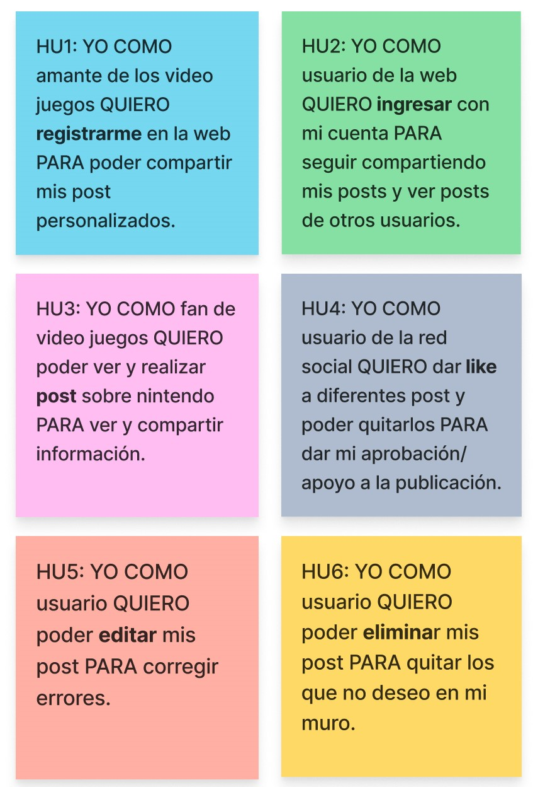
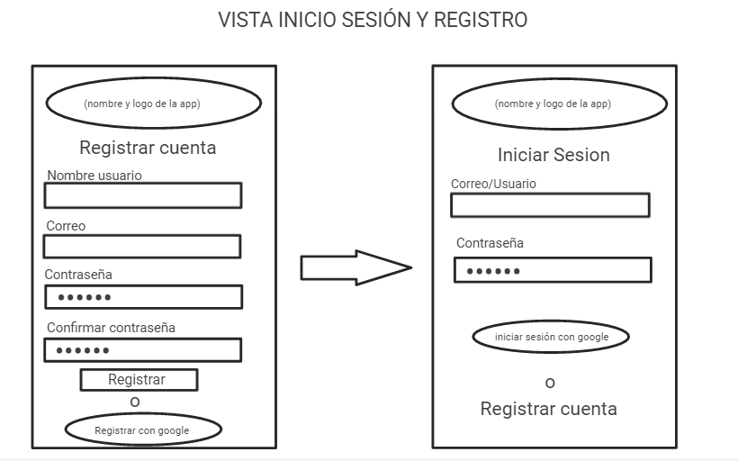
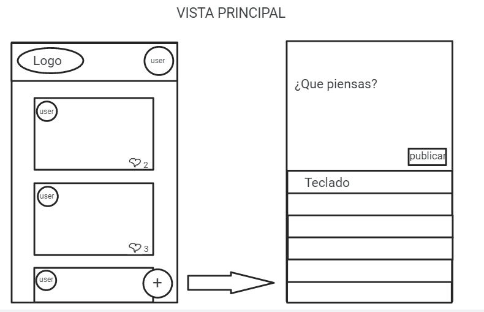
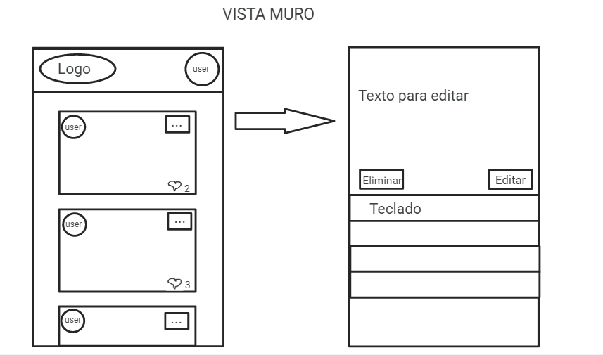
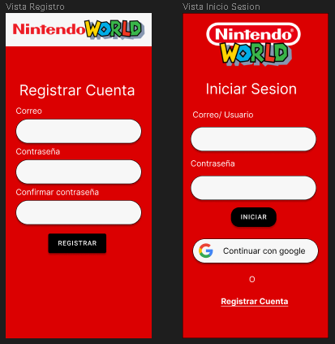
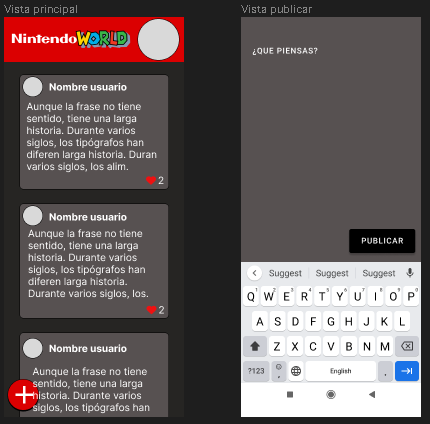
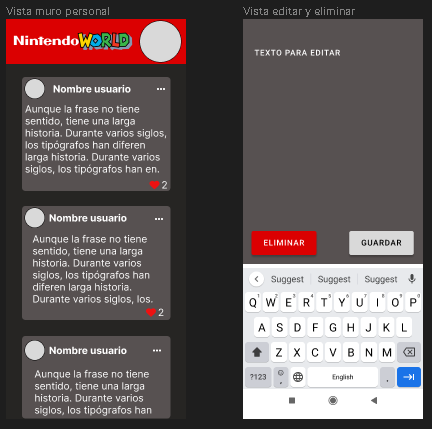

# 🄽🄸🄽🅃🄴🄽🄳🄾 🅆🄾🅁🄻🄳

# Biendenid@s al repositorio de Teresa Barrios y Giselle Cifuentes!

Nuestra idea de proyecto surge de la necesidad evidente que tienen los fans de Nintendo de conectarse entre sí y compartir su amor por los juegos y personajes icónicos que esta marca ha creado. Para hacer posible este encuentro, creamos una app que facilita la creación, edición y eliminación de publicaciones, así como la interacción con otros usuarios mediante la opción de dar "likes" a los comentarios y mucho más.

Con esta app, nuestro objetivo es brindar a la comunidad de Nintendo una plataforma segura y fácil de usar, en la que puedan conectarse y compartir sus experiencias de juego, estrategias, opiniones y descubrir las últimas noticias, lanzamientos y novedades relacionadas con esta marca.

En definitiva, nuestra app busca satisfacer las necesidades de la comunidad de Nintendo para que puedan compartir su amor y pasión por los juegos y personajes icónicos de la marca como Mario, Zelda y Pokemon, entre otros, con una experiencia de usuario única y satisfactoria.

## Historias de usuario:

## Prototipos: 

__Prototipo Baja Fidelidad:__

__Prototipo Alta Fidelidad:__

[Has Click aqui para ver el prototipo en Figma](https://www.figma.com/file/rar3VutV7to8xH18i2P0dg/Untitled?type=design&node-id=0-1&t=1Gdco5rDmrOLqJtg-0)

**Experiencias de usuario**

Los comentarios de los usuarios fueron mayoritariamente positivos y muchos expresaron que les gustó la idea de Nintendo, ya que les recordaba su infancia jugando videojuegos.

Además, recibimos recomendaciones valiosas de los usuarios, quienes sugirieron que se ordenaran los comentarios por fecha de publicación y que se indicara claramente si un comentario ya había recibido un "like" o no, ya que actualmente esto no es del todo claro.

En relación a los feedback sugirieron unos cambios para mejorar la usabilidad/visibilidad, tal y como:
 - La imagen del ícono para hacer logOut no era intuitiva para conocer su funcionalidad, por lo tanto, se le agrega un ícono extra encima del anterior para hacer más intuitiva su función.
 - La ubicación del botón para agregar publicaciones tapaba una porción de los posts, por lo que se ideó que al realizar scroll hacia abajo, el botón se desvanece y al hacer scroll hacia arriba, el botón vuelve a aparecer.
 - La vista registro no tenía ninguna forma para regresar a ola vista anterior. Por esta razón, se agrega el botón regresar para facilitar la navegación entre estas vistas.
 

**Objetivos de aprendizaje**

### HTML
- [✅] **Uso de HTML semántico**
 
### CSS
- [✅] **Uso de selectores de CSS**

- [✅] **Modelo de caja (box model): borde, margen, padding**

- [✅] **Uso de flexbox en CSS**
 
- [✅] **Uso de CSS Grid Layout**

- [✅] **Uso de selectores del DOM**
 
- [✅] **Manejo de eventos del DOM (listeners, propagación, delegación)**
 
- [✅] **Manipulación dinámica del DOM**

- [✅] **Ruteado (History API, evento hashchange, window.location)**
 
### JavaScript
- [✅] **Arrays (arreglos)**

- [✅] **Objetos (key, value)**
 
- [✅] **Uso de bucles/ciclos (while, for, for..of)**
  
- [✅] **Funciones (params, args, return)**
  
- [✅] **Pruebas unitarias (unit tests)**
 
- [✅] **Pruebas asíncronas**
 
- [✅] **Uso de linter (ESLINT)**
- [✅] **Uso de identificadores descriptivos (Nomenclatura y Semántica)**
- [✅] **Diferenciar entre expresiones (expressions) y sentencias (statements)**
- [✅] **Callbacks**
  
### Control de Versiones (Git y GitHub)
- [✅] **Git: Instalación y configuración**
- [✅] **Git: Control de versiones con git (init, clone, add, commit, status, push, pull, remote)**
- [✅] **Git: Integración de cambios entre ramas (branch, checkout, fetch, merge, reset, rebase, tag)**
- [✅] **GitHub: Creación de cuenta y repos, configuración de llaves SSH**
- [✅] **GitHub: Despliegue con GitHub Pages**
 
### Firebase
- [✅] **Firebase Auth**

- [✅] **Firestore**

⠀⠀⠀⠀⠀⠀⠀⠀⠀⠀⠀⠀⠀⠀⠀⠀⠀⠀⠀⠀⠀⠀⠀⠀⠀⠀⠀⠀⡇⠀⠀⠀⠀⠀⠀⠀⠀⠀⠀⠀⠀⠀⠀⠀⠀⠀⠀⠀⠀⠀⠀⠀⠀⠀⠀⠀⠀⠀⠀⠀⠀⠀⠀⠀
⠀⠀⠀⠀⠀⠀⠀⠀⠀⠀⠀⠀⠀⠀⠈⠲⣄⢀⡀⠀⠀⠀⠀⠀⠀⢀⠄⠀⣸⠀⠀⠀⠀⠀⠀⠀⠀⠀⠀⠀⠀⠀⠀⠀⠀⠀⠀⠀⠀⠀⠀⠀⠀⠀⠀⠀⠀⠀⠀⠀⠀⠀⠀⠀
⠀⠀⠀⠀⠀⠀⠀⠀⠀⠀⠀⠀⠀⠀⠀⡄⠈⠳⣕⢄⠀⠀⠀⠀⢠⣏⠀⠀⣹⡆⠀⠀⠀⠀⠀⠀⣀⡀⣀⠀⠀⠀⣄⠀⠀⠀⠀⠀⠀⠀⠀⠀⠀⠀⠀⠀⠀⠀⠀⠀⠀⠀⠀⠀
⠀⠀⠀⠀⠀⠀⠀⠀⠀⠀⠀⠀⠀⠀⠀⡇⠀⠀⢸⡿⡷⣄⣤⣾⣿⣯⣿⣿⣿⣧⡀⠀⠀⢀⠀⠀⠈⣻⣿⣻⢿⣶⢿⣷⣄⠀⠀⠀⠀⠀⠀⠀⠀⠀⠀⠀⠀⠀⠀⠀⠀⠀⠀⠀
⠀⠀⠀⠀⠀⠀⠀⠀⠀⠀⠀⠀⠀⠀⠀⣽⠀⡖⣯⢳⣿⣿⣿⡟⠛⡞⣿⣽⣿⣿⣧⣼⠃⢸⣧⣷⣿⡟⣷⣯⡟⣾⢻⡞⣿⡆⠀⠀⠀⠀⢠⠀⠀⠀⠀⠀⠀⠀⠀⠀⠀⠀⠀⠀
⠀⠀⠀⠀⠀⠠⠤⣀⡀⠀⠀⠀⠀⣀⣼⣧⠽⠒⠋⠉⠉⠉⠉⠉⠙⠓⠿⠿⠛⠋⠉⣄⠀⢻⣿⣿⡿⣽⣳⢯⡿⣽⢯⡿⣽⣷⠀⠀⠀⠀⢸⡄⠀⠀⠀⠀⠀⠀⠀⠀⠀⠀⠀⠀
⠀⠀⠀⠀⠀⠱⡀⠀⠈⠉⢓⢾⣿⡿⠋⠀⠀⠀⠀⠀⠀⠀⠀⠀⠀⠀⠀⠀⠀⠀⣀⣿⡄⠀⠐⢹⣿⡷⣯⢿⡽⣯⢿⡽⣷⣿⠀⢀⣤⣷⣼⠁⠀⠀⠀⠀⠀⠀⠀⠀⠀⠀⠀⠀
⠀⠀⠀⠀⠀⠀⠘⢦⠀⣠⢯⡿⠋⠀⠀⠀⠀⢀⣀⠀⠀⢀⣠⣆⣴⡄⣀⠀⢄⠂⠄⡷⠻⣦⣤⣾⣿⣽⣯⡿⣽⢿⣾⡉⢏⡿⣿⣿⣻⣿⠋⠀⠀⠀⠀⠀⠀⠀⠀⠀⠀⠀⠀⠀
⠀⠀⠀⠀⠀⠀⠀⠀⢿⣵⠟⠀⢀⡠⠔⠚⠉⣡⡈⠉⠉⠛⠻⣿⣿⣿⣷⣮⣦⣴⣾⣷⣿⠿⠿⠾⣌⣛⡟⠉⣻⣯⣿⣧⠨⣽⣿⣞⣿⠟⠀⠀⠀⠀⠀⠀⠀⠀⠀⠀⠀⠀⠀⠀
⠀⠀⠀⠀⠀⠀⠀⠀⣼⠏⠀⡔⠁⠀⠀⠀⣀⢴⣹⠶⢳⣀⠀⢻⣿⣛⡹⠿⠿⣿⣭⠝⠀⠀⠀⠀⠈⠹⣷⣤⣿⣈⣽⣻⠵⠿⠿⣭⣿⣤⡀⠀⠀⠀⠀⠀⠀⠀⠀⠀⠀⠀⠀⠀
⠀⠀⠀⠀⠀⠀⣠⣼⡟⠀⣸⠀⠀⠀⠀⣦⣾⣿⣿⣿⣿⡿⠟⠚⠋⢄⡀⠀⢰⠋⢳⠀⠀⠀⠀⠀⠀⠀⠀⠀⠀⠀⢀⠀⠈⠀⠀⠐⠋⣟⣿⠀⠀⠀⠀⠀⠀⠀⠀⠀⠀⠀⠀⠀
⢄⡀⠀⠀⠀⠈⡷⡿⠀⠀⡇⠀⠀⢠⣮⣁⣽⣿⣿⠟⠋⠁⠀⠀⢀⠞⠻⣦⢾⣦⡾⠁⠀⢠⢶⣷⡀⠀⠀⠀⠀⠀⠈⣇⠀⠀⠀⣠⡾⣼⡟⡆⠀⠀⠀⠀⠀⠀⠀⠀⠀⠀⠀⠀
⠀⠉⠲⢤⣠⡴⣹⠃⠀⠀⣧⠀⢠⣾⣿⣿⣿⠏⠀⠀⠀⠱⣽⠞⢻⠦⡤⢿⣌⢿⣿⣤⠀⠈⣿⠿⣷⡄⣀⠀⠀⠀⣠⠹⣄⣠⠾⢋⡴⢇⢣⠇⠀⠀⠀⠀⠀⠀⠀⠀⠀⠀⠀⠀
⠀⠀⠀⠀⠘⢷⡟⠀⠀⠀⣿⢤⠘⣿⣿⣿⡏⠀⢠⡀⠀⠀⣸⣷⢪⠝⣰⢃⡞⢮⣿⣿⡄⠀⢹⣶⣿⣿⣶⡴⢶⣿⣲⣯⣿⣿⡏⡙⣬⠼⠋⠀⠀⠀⠀⠀⠀⣠⡄⠀⠀⠀⠀⠀
⠀⠀⠀⠀⠀⢸⠁⠀⠀⣸⠇⢸⣿⠏⣿⣿⡁⠀⠀⢿⣆⡾⠀⣿⣇⠹⣆⢏⡸⢆⡈⣹⣷⡀⢸⠏⢸⣿⣿⣷⣿⣿⣿⣿⣿⣾⣇⣾⢀⣶⣆⣀⣀⣀⣰⠶⡿⢱⠎⣀⠀⠀⠀⠀
⠀⠀⠀⠀⠀⠸⠀⠀⢀⡏⢀⣿⣽⠲⢾⣿⡇⠀⠠⢜⢢⠟⣦⡼⢧⢋⡖⢎⡱⠮⢵⡏⡹⡇⠀⠑⣿⡿⠛⣿⣿⣿⣿⡿⣭⣟⣹⣿⣿⣾⣿⡟⢏⡱⢌⢣⡱⢣⣫⢖⢧⣋⠖⠄
⠀⠀⠀⠀⢠⠀⠀⠀⡘⠁⣼⡿⠁⠀⠀⠉⠛⠦⣵⣎⣦⠕⢊⣀⣊⣜⠸⣏⡛⡛⠞⡹⠳⣷⠀⠀⠀⠁⠀⠋⠉⠉⠉⠀⠻⣧⣿⣿⣿⣿⢣⡙⣌⠲⣩⢲⡱⣣⠏⣎⣓⡬⠆⠀
⠀⠀⠀⠀⠎⠀⠀⠠⠁⢠⡿⠁⠀⠀⠀⠀⠀⠀⠀⠀⠀⡴⢢⡔⡿⠀⠑⠨⠙⠶⣥⣆⣑⠌⢣⡀⠀⠀⠀⢀⠀⣀⠂⣄⡾⢩⣿⣹⣻⣿⠋⠛⠛⠶⣇⢇⡚⡥⢞⡭⣚⠼⣱⡀
⠀⠀⠀⠀⣽⠀⠀⠄⢐⡾⠁⠀⠀⠀⠀⠀⠀⠀⠀⠀⠑⣌⠳⣼⡅⠈⡲⢦⣉⠒⡰⢈⠉⡉⢉⣽⡷⣶⣟⡛⠻⢤⡃⠊⡤⣞⣿⣿⣿⣿⣆⠀⠀⣠⠞⢾⡴⡙⡮⠆⠉⢚⠀⠃
⠀⠀⠀⠀⣯⠽⠖⠖⢻⡁⠀⠀⠀⠀⠀⠀⠀⠀⠀⠀⠠⢌⠻⣜⢛⢦⡁⢆⡉⡙⠁⠂⠀⣴⡞⢯⡜⢧⡹⣛⣦⡀⠉⠓⠛⠶⠾⣿⣿⣿⣿⣷⣦⣽⣦⣤⠷⠋⠁⠀⠀⠀⠀⠀
⢀⣠⠴⠚⠁⢠⠠⡀⠼⡆⠀⠀⠀⠀⠀⠀⠀⠀⠀⠀⠐⢌⢣⡝⡌⠦⡉⢆⡐⠄⠁⣴⣞⠳⣜⢣⠞⣥⠳⣍⠞⣵⡀⠀⠀⠀⠀⠀⠉⠙⠛⠋⠁⠀⠀⠀⠀⠀⠀⠀⠀⠀⠀⠀
⠘⠻⢦⣱⣌⢢⡑⣌⠲⡿⠁⠀⠀⠀⠀⠀⠀⠀⠀⠀⠌⡜⡲⠜⢨⠓⠈⢄⣠⣴⢛⢧⠪⡝⣌⢧⣋⠶⡹⢌⡻⢼⠁⠀⠀⠀⠀⠀⠀⠀⠀⠀⠀⠀⠀⠀⠀⠀⠀⠀⠀⠀⠀⠀
⠀⠀⠀⠀⠈⠉⠉⠉⢉⡇⠀⠀⠀⠀⠀⠀⠀⠀⡀⢢⠑⡬⢱⢩⠟⠙⠛⠛⠒⣳⢏⠶⣙⠼⣘⠦⣍⢮⡱⣍⣾⠃⠀⠀⠀⠀⠀⠀⠀⠀⠀⠀⠀⠀⠀⠀⠀⠀⠀⠀⠀⠀⠀⠀
⠀⠀⠀⠀⠀⠀⠀⠀⡎⠀⠀⠀⠀⠀⠀⠀⠄⢢⢅⢣⠚⡔⢣⠏⠀⠀⠀⠀⠀⣟⢎⡳⣉⠮⢥⢫⠴⣢⢓⢾⣁⠀⠀⠀⠀⠀⠀⠀⠀⠀⠀⠀⠀⠀⠀⠀⠀⠀⠀⠀⠀⠀⠀⠀
⠀⠀⠀⠀⠀⠀⠀⡸⠀⠀⠀⠀⠀⠀⢀⠇⡸⢃⠼⡘⠟⣸⠟⠀⠀⠀⠀⠀⢸⣛⡜⢣⡛⡼⣃⢟⡼⣣⢟⡻⢼⢧⡀⠀⠀⠀⠀⠀⠀⠀⠀⠀⠀⠀⠀⠀⠀⠀⠀⠀⠀⠀⠀⠀
⠀⠀⠀⠀⠀⠀⢰⠃⠀⠀⠀⠀⠠⠨⣐⢪⢑⡋⣎⣱⠽⠃⠀⠀⠀⠀⠀⠀⣿⢄⡏⢧⡙⢶⠩⡞⢴⢣⠎⣽⡷⣿⣻⡄⠀⠀⠀⠀⠀⠀⠀⠀⠀⠀⠀⠀⠀⠀⠀⠀⠀⠀⠀⠀
⠀⠀⠀⠀⠀⠀⣾⠀⠀⠀⠀⠀⠀⠀⠀⠈⠈⣏⠉⣻⣆⠀⠀⠀⠀⠀⠀⠀⠈⠚⠾⠧⠾⠥⠿⠼⠾⠾⠽⠾⠓⠓⠀⠀⠀⠀⠀⠀⠀⠀⠀⠀⠀⠀⠀⠀⠀⠀⠀⠀⠀⠀⠀⠀
⠀⠀⠀⠀⠀⠀⠘⠦⣀⠀⢀⡤⠒⢦⣠⠖⠚⣟⡎⠙⡏⠀⠀⠀⠀⠀⠀⠀⠀⠀⠀⠀⠀⠀⠀⠀⠀⠀⠀⠀⠀⠀⠀⠀⠀⠀⠀⠀⠀⠀⠀⠀⠀⠀⠀⠀⠀⠀⠀⠀⠀⠀⠀⠀
⠀⠀⠀⠀⠀⠀⠀⠀⠀⠉⠑⠒⠤⠞⠻⠦⢄⡟⠋⠒⠃⠀⠀⠀⠀⠀⠀⠀⠀⠀⠀⠀⠀⠀⠀⠀⠀⠀⠀⠀⠀⠀⠀⠀⠀⠀⠀⠀⠀⠀⠀⠀⠀⠀⠀⠀⠀⠀⠀⠀⠀⠀⠀⠀
